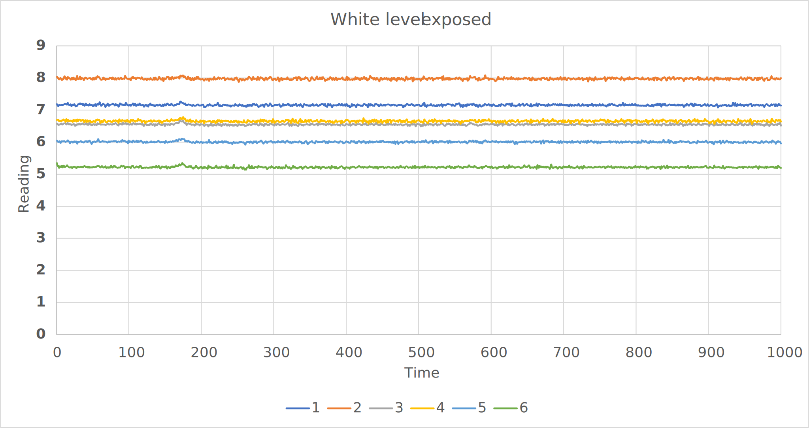
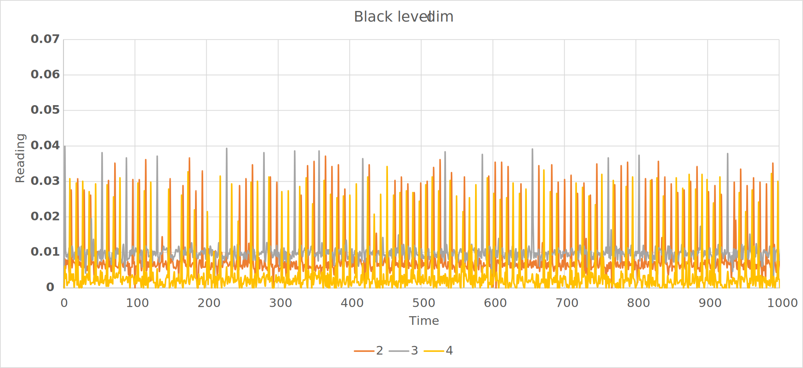

\page journey Technical Demo Documentation
[TOC]
# Overview {#overview}

We had at least 4 technical demonstrations (TD) for this semester, accessing different parts of the buggy. They emphasised the hardware control, especially the motors and the software solutions to interface the microcontroller and other components like sensors and Bluetooth module.

# TD1: Motor Control {#motor}

On the software side, the key task was setting up the encoders and motors to work as intended. I settled down on a **20% duty cycle** to keep it steady and avoid any translational inertia after stopping. PWM frequency set to **1000 Hz** because the wheels were louder than the switches, why not? The heatsink was also not too hot to touch. I chose to use **unipolar mode** as this offered less switching losses.
\dot
digraph System{
    
    
	fontname="Arial";
	fontsize="14pt";
    node [shape=record style=filled fillcolor=gray95 fontname="Arial" fontsize="11pt"];
    
    subgraph cluster_nucleo{
       	label="NUCLEO F401RE";
        {rank=same motor left_encoder right_encoder ;}
		{rank=same qei}
		color =blue;
    }
        
   motor[label = <{<b>motor</b>|Left PWM<br align="left"/>Right PWM<br align="left"/>enable<br align="left"/>left direction<br align="left"/>right direction<br align="left"/>|forward()<br align="left"/>|reverse()<br align="left"/> |turnright()<br align="left"/>|turnleft()<br align="left"/>}>]
    
    qei[label = <{<b>QEI</b>|getPulses()<br align="left"/>}>]
    
    left_encoder[label = <{<b>Left Encoder</b>|velocity<br align="left"/>distance<br align="left"/>| read_velocity()<br align="left"/>| read_distance()<br align="left"/>}>]
    
    right_encoder[label = <{<b>Right Encoder</b>|velocity<br align="left"/>distance<br align="left"/>| read_velocity()<br align="left"/>| read_distance()<br align="left"/>}>]
    
    edge [dir=back arrowtail=empty style=""]
    qei  -> right_encoder 
    qei  -> left_encoder
    
}
\enddot

The encoder was connected directly to the wheel shaft, and from there we could measure the speed of the rotating wheel. The QEI library encoded the pulses to **X2 resolution**, so we need to scale it down to get actual number of pulses. We also knew the number of pulses per revolution (CPR) was **256**.
\f{align}{
  
pulses &= \frac{pulses}{2} \\
rev &= \frac{pulses}{256} \\
distance &= rev \times 2 \pi r \\
velocity &= \frac{distance}{time} \\

\f}

One of the tasks was to make a square of 0.5 m length. The hardest part was the square had to be in between the wheels. Even worst, I did not tune the task on the actual square at A16. The snippet below shows how I implemented the square sequence.

**main.cpp**
```cpp
Motor  motor(PC_9,PB_8,PC_8,PC_6,PB_9);
Encoder  wheel_left(PC_3,PC_2);
Encoder  wheel_right(PB_14,PB_13);

while(1){

    vector<double> linear {...};
    vector<double> rotation {...};
    
    for(size_t i=0; i < linear.size(); i++){
        Motor::forward(linear,....);
        Motor::turnright(rotation,...);
    }
}
```

Ideally all values in linear vector are 0.5 m and rotation vector are 90°. However, ours looked like this

```cpp
vector<double> linear { 0.45, 0.33, 0.33, 0.43};
vector<double> rotation {83, 83, 83, 175};
```

Note that the last one was more than 90° because the task was to trace the square back which was harder when your buggy did not move in straight line. I used bang-bang control approach to compensate any tiny deviation between the two wheels, implemented in the Motor::forward.

**motor.cpp**
```cpp	
if ( left_encoder > right_encoder)

    right_motor.write(SLOW_PWM * correction);
    left_motor.write(SLOW_PWM)

else if ( right_encoder > left_encoder)

    left_motor.write(SLOW_PWM * correction);
    right_motor.write(SLOW_PWM)
```
\f{align}{
correction &= \frac{pulse_N}{pulse_M} \  where \ pulse_N > pulse_M \\
\f}
We received full marks on TD1 and this assured us a good start of our journey in producing a winning buggy.

# TD2: Sensors {#sensor}

This was where we had to interface the sensors and bluetooth module with the microcontroller. The bluetooth module was easily configured by connecting to the correct RX, TX pins. In this case I used **BufferedSerial** to handle the communication between F401RE and HM-10. Sensors were the tricky bit, since we chose not to arrange it in a one row but two instead. However, I will discuss on general process of configuration and calibration without considering our chosen arrangement.

\dot
digraph System{
    
	fontname="Arial";
	fontsize="14pt";
    node [shape=record style=filled fillcolor=gray95 fontname="Arial" fontsize="11pt"];
    
    subgraph cluster_nucleo{
        label ="NUCLEO F401RE"
        sensor;
        color=blue;
        
        subgraph cluster_ble{
            ble
            label="HM10"
            color=red;
        }
        
    }
    
   sensor[label = <{<b>sensor</b>|AnalogIn in[6]<br align="left"/>BusOut pins<br align="left"/>scale_factor[6]<br align="left"/>treshold[6]<br align="left"/>|read()<br align="left"/>|calibrate()<br align="left"/>}>]
    
    ble[label = <{<b>BufferredSerial</b>|readable()<br align="left"/>|read()<br align="left"/>}>]
}
\enddot

It was easier to manage 6 sensors if they are connected to op-amp as this approach allowed calibration only using potetiometer instead of software. Since this was not available to us, we had to calibrate the black and white level of the sensors.

1. The **white level** was calibrated by placing **white card** under the sensors and toggling the sensors under **normal condition at fixed height from the sensors**. *Does VDD matter?* No, because reading was already normalised, you can do whatever scaling you want as long as you comfortable with it. Here, I choose a saturation level of **10**.

	Recall that I had *raw uncalibrated data (white level)*
	|S1|S2|S3|S4|S5|S6|
	|-|-|-|-|-|-|
	|3.18998|3.26268|3.07483|3.12763|3.22799|3.70966|

	How big is the scale factor to make it **10**?
	|S1|S2|S3|S4|S5|S6|
	|-|-|-|-|-|-|
	|3.13481|3.06497|3.25221|3.19731|3.09790|2.69567|

	Now, just apply a scale factor to each sensor to scale it to the desired maximum level.
	@note We assumed the sensors scale linearly. *But did it?*

2. The **black level** was calibrated by placing **black track** under the sensors and toggling the sensors under **minimum light condition**. This ensured we get minimum treshold value at minimum external noise(infrared). *What to do with black level?* It was pretty much pointless to read small values that was not useful for distance calculation, so the black level is the treshold of the sensor activation.

3. Although we expected perfect results by calibration, there will be always external noise coming from sunlight and other sources. The issue needed to be addressed to avoid unreliable readings consisting of random errors. 

	\f$ reading_i = noise_i + emitter_i \f$

	@note Noise is simply background reading when none of the emitter is turned on.
	
	Measurements of the analog input when all emitter is off at the start of each read was very easy to implement. When this is done correctly, you get the best intended readings from the sensor.

<details><summary>more...</summary>
Showcase some of the tests done to calibrate the sensors.<br/>
<div align="center">

White level raw<br/><br/>

Black level raw<br/><br/>

Sweeping the white card back and forth to the sensor.
</div>
</details>

This part was where I realised how important normalised readings for distance calculation. If all readings were normalised to a level, distance formula simply became weighted mean of sensor readings. From the sensor array, if we established a pivot point between sensor 3 and 4, we could assign weight for every sensor based on its distance from pivot like in the example below.

\dot
digraph Sensor{
    
	fontname="Arial";
	fontsize="14pt";
	node [shape=circle style=filled fillcolor=lightblue fontname="Arial" fontsize="11pt"];
     
   subgraph cluster_sensors{
       label="Sensor location"
       sensor6;sensor5;sensor4;sensor3;sensor2;sensor1;
       color = blue;
   }
   
   sensor1[label = 1]
   sensor2[label = 2]
   sensor3[label = 3]
   sensor4[label = 4]
   sensor5[label = 5]
   sensor6[label = 6]

}
\enddot

\dot
digraph Weight{
    
	fontname="Arial";
	fontsize="14pt";
	node [shape=record style=filled fillcolor=lightblue fontname="Arial" fontsize="11pt"];
    rankdir =LR;
    
    subgraph cluster_weight{
       label="Weight of each sensor"
       weight;
       color = blue;
    }

weight[label = <{-30||-20|| -10 |  | 10 ||20||30}>]

}
\enddot

The solution was very simple and the equivalent formula was \f$\ distance = \frac{\sum_{1}^{6} reading_i \times weight_i}{\sum_{1}^{6} reading_i} \f$

