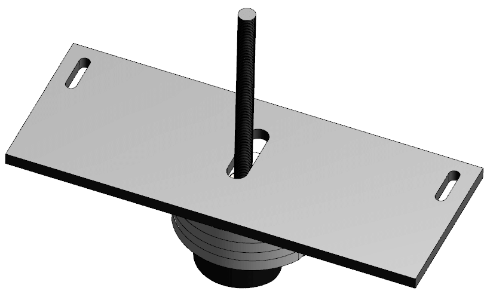
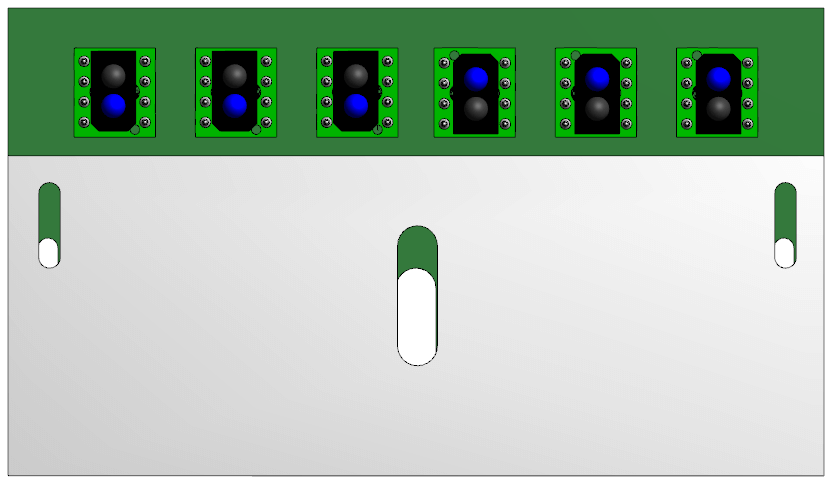
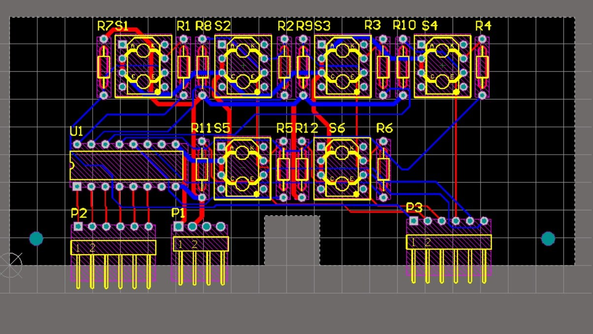
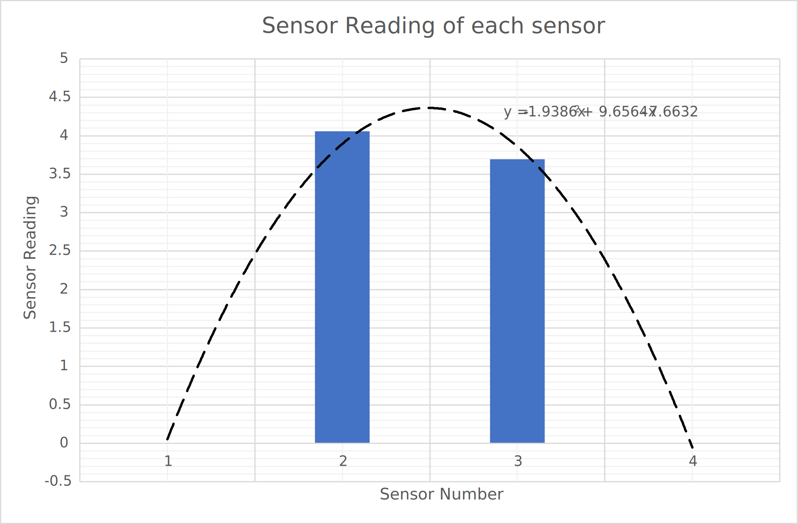

\page features Innovative Features

# Background {#background}

[TOC]

High speed buggy is very achievable by all groups, but cornering will punish those who overlook their control algorithm.
Either the buggy will overshoot at high speed, or the buggy will slow down and take the corner wisely.
Is there a way to corner without lowering current speed? Of course, it is possible with the correct implementation of signal processing.
Signal processing is important for line following robot to achieve stability in performance.
Simply reading the output of the sensors will not give meaningful components to the software if it is not processed the correct way.
This page discusses our attempt to get the best out of the buggy system by incorporating hardware and software solutions to the stated problem.

# Hardware Solution {#hardware}

Although we try our best to test the sensor and get the optimum operating height, it can vary depending on the environment.
So designing a chassis based on this constraint may cause trouble for iterative development as we go forward.
This also might cause a problem because we only test one sensor to characterise it, not as an array of sensors which we will be using in the final assembly.
Our solution to this problem to use a system that allow us to change the height of the sensors from ground when the sensors are calibrated.
The plate for the sensors can be clamped at height from the ground of between 2.5 cm up to 6 cm.  
  

  
However, this solution only fix the problem in vertical-axis direction.
Hence, we further design the sensor plate with long holes to allow adjustable position of the PCB by using nuts and bolts.

Both of this design approach gives us flexibility to choose the height and position of the sensors that we want, resulting to better output of the sensors' readings. Next, our sensor array design consist of two rows instead of traditional one row system. The inner row consist of two sensors, and the front row consists of four sensors. We created this design based on the consideration that we want to maximise number of sensors operating and reading outputs. While 6 sensors in a row cover the line almost by 4x its width, our arrangement benefits from its additional row. This allow the buggy to immediately respond to incoming corners when detected by the front row sensors.

# Software Solution {#software}

Determining the position of the line is very simple by using weighted average as discuss in [this section](#autotoc_md9). Recall again that it is simply \f$\ distance = \frac{\sum_{1}^{6} reading_i \times weight_i}{\sum_{1}^{6} reading_i} \f$. This simple method is fast and simple but it is not the best way to determine the position of sensors. The alternative method is to use quadratic interpolation from the sensors. Using this method, not all sensors will be used for calculations because the problem is overdetermined so only four nearest to the sensors output is chosen to simplify the problem. Maybe it is easier to visualise this concept using the figure below.

The position can be determined from \f$ distance = -\frac{b}{2a} \f$. To be explained.

# Results {#results}

Adjusting the height....  
graph reading vs height  
  
Quadratic vs weighted average software solution.  
Graph distance vs (error_1 vs error_2).  
Graph no of sample vs (time_1 vs time_2).
