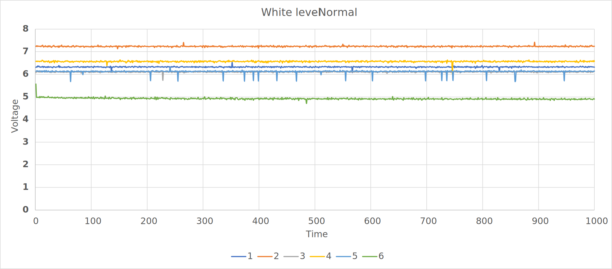
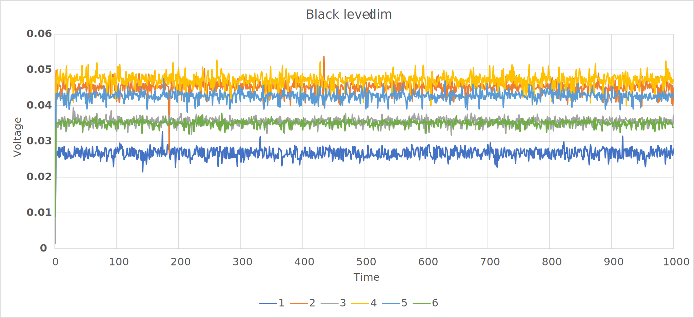
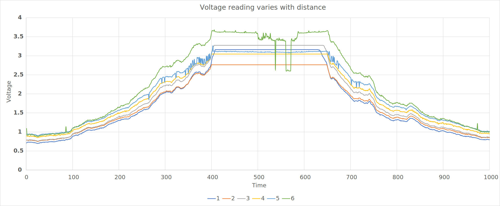

\page journey Technical Demo Documentation
# Overview

We had at least 4 technical demonstrations (TD) for this semester, accessing different parts of the buggy. They emphasise on the hardware control especially the motors and the software solutions on interfacing the microcontroller and other components like sensors and bluetooth module.

# TD1 : Motor Control

On software side, the key task was getting the encoders and motors working as intended. After testing, I discovered that the distance scaled up with the speed of the motors, which make the distance reading unreliable. So, I settled down on **20% duty cycle** to keep it steady and avoid any residue momentum after stopping. PWM frequency was set at **1000 Hz** because the wheels were louder than the switches, why not? The heatsink was also not too hot to touch. I chose to use **unipolar mode** as this offers less switching losses.
\dot
digraph System{
    
    
	fontname="Arial";
	fontsize="14pt";
    node [shape=record style=filled fillcolor=gray95 fontname="Arial" fontsize="11pt"];
    
    subgraph cluster_nucleo{
       	label="NUCLEO F401RE";
        {rank=same motor left_encoder right_encoder ;}
		{rank=same qei}
		color =blue;
    }
        
   motor[label = <{<b>motor</b>|Left PWM Right PWM enable left direction right direction |forward() |reverse()  |turnright() |turnleft() }>]
    
    qei[label = <{<b>QEI</b>|getPulses() }>]
    
    left_encoder[label = <{<b>Left Encoder</b>|velocity distance | read_velocity() | read_distance() }>]
    
    right_encoder[label = <{<b>Right Encoder</b>|velocity distance | read_velocity() | read_distance() }>]
    
    edge [dir=back arrowtail=empty style=""]
    qei  -> right_encoder 
    qei  -> left_encoder
    
}
\enddot

One of the tasks was to make a square of 0.5 m, which I did not know they were so strict about the square. **The square had to be in between the wheels**. 

*main.cpp*

    Motor  motor(PC_9,PB_8,PC_8,PC_6,PB_9);
    Encoder  wheel_left(PC_3,PC_2);
    Encoder  wheel_right(PB_14,PB_13);
	
	while(1){
	
		vector<double> linear {...};
		vector<double> rotation {...};
		
		for(size_t i=0; i < linear.size(); i++){
			Motor::forward(linear,....);
			Motor::turnright(rotation,...);
		}
	}

Above shows a snippet on how I implemented the square sequence. Ideally all values in linear vector are 0.5 m and rotation vector are 90° . However, our vectors looked like this

    vector<double> linear { 0.45, 0.33, 0.33, 0.43};
	vector<double> rotation {83, 83, 83, 175};
Note that the last one was more than 90° because the task was to trace the square back! Which was harder when your buggy did not move in straight line. I used bang-bang approach to compensate the tiny deviations between two wheels, implemented in the Motor::forward.

*motor.cpp*
	
	if ( left_encoder > right_encoder)

		right_motor.write(SLOW_PWM*(correction));
		left_motor.write(SLOW_PWM)

	else if ( right_encoder > left_encoder)

		left_motor.write(SLOW_PWM*(correction));
		right_motor.write(SLOW_PWM)
	

Correction is evaluated by ratio of bigger encoder number to smaller encoder number, giving percentage around 110%.

We have received full marks on TD1. This promises us a good start in our journey in producing a winning buggy.

# TD2 : Sensors

This is where we have to interface sensors and bluetooth module with the microcontroller. The bluetooth part is easily done by connecting to correct RX, TX terminal. In this case I used **BufferedSerial** to handle the communication between F401RE and HM-10. Sensors are the tricky bit, since we chose not to arrange it in a one row but two instead. However, I will discuss on general process of configuration and calibration without considering the arrangement.

\dot
digraph System{
    
	fontname="Arial";
	fontsize="14pt";
    node [shape=record style=filled fillcolor=gray95 fontname="Arial" fontsize="11pt"];
    
    subgraph cluster_nucleo{
        label ="NUCLEO F401RE"
        sensor;
        color=blue;
        
        subgraph cluster_ble{
            ble
            label="HM10"
            color=red;
        }
        
    }
    
   sensor[label = <{<b>sensor</b>|AnalogIn in[6] BusOut pins scale_factor[6] treshold[6] |read() |calibrate() }>]
    
    ble[label = <{<b>BufferredSerial</b>|readable() |read() }>]
}
\enddot

It is easier manage 6 sensors if they are connected to op-amp, this approach allows calibration only using potetiometer instead of software. Since this is not available to us, we need to calibrate black and white level of the sensors.

1. The **white level** can be calibrated by placing **white card** under the sensor and turning the sensor under **normal condition at fixed height from the sensors**. *Does VDD matter?* No, because reading is normalised,you can do whatever scaling you want as long as you understand. Here, I choose maximum level of **10**.

	Recall that I have *raw uncalibrated data (white level)*
	|%Sensor 1|%Sensor 2|%Sensor 3|%Sensor 4|%Sensor 5|%Sensor 6|
	|-|-|-|-|-|-|
	|6.326|7.234|6.107|6.565|6.122|4.921|

	How big is the scale factor to make it **10**?
	|%Sensor 1|%Sensor 2|%Sensor 3|%Sensor 4|%Sensor 5|%Sensor 6|
	|-|-|-|-|-|-|
	|1.580|	1.382|	1.637|	1.523|	1.633|	2.032|

	Now, just apply a scale factor to each sensor to scale it to desired maximum level
	@note We have assume the sensors scale linearly. *But does it?*

2. Next, the **black level** can be calibrated by placing **black track** under the sensor and turning the sensor under **minimum light condition**. This ensures we get minimum treshold value at minimum external noise(infrared). *What to do with black level?* It is pretty much pointless to read small values that is not useful to distance calculation, so black level is the treshold of the sensor reading.

3. Although we expect perfect results by calibration, there are always external noise coming from sunlight and other sources. This issue needed to be addressed to avoid unreliable readings consist of random errors. 

	\f$ reading_i = noise_i + emitter_i \quad \quad where \quad reading_i > treshold_i \f$

	@note Noise is simply background reading when none of the emitter is turn off.
	
	Measurements of the analog input when all emitter is off at the start of each read is very easy to implement. When this is done correctly, we will get the best intended readings from the sensor.

more...

Showcase some of the tests done to calibrate the sensors. 

White level raw  

Black level raw  

Sweeping the white card back and forth to the sensor.

This part is where I realised how important scaling factor impact the results. If all readings normalised to 10, distance calculation is simplified because of the linear properties we see before. From the sensor array, if we establish a coordinate system with its axis between sensor 3 and 4, we can assign weight for each sensor like in the example below.

\dot
digraph Sensor{
    
	fontname="Arial";
	fontsize="14pt";
	node [shape=circle style=filled fillcolor=lightblue fontname="Arial" fontsize="11pt"];
     
   subgraph cluster_sensors{
       
       sensor6;sensor5;sensor4;sensor3;sensor2;sensor1;
       color = blue;
   }
   
   sensor1[label = 1]
   sensor2[label = 2]
   sensor3[label = 3]
   sensor4[label = 4]
   sensor5[label = 5]
   sensor6[label = 6]

}
\enddot

|%Sensor 1|%Sensor 2|%Sensor 3|%Sensor 4|%Sensor 5|%Sensor 6|
|-|-|-|-|-|-|
|-30|-20|-10|10|20|30|

which can be reduced to
\f$\ distance = \sum_{1}^{6} reading_i \times weight_i \f$

